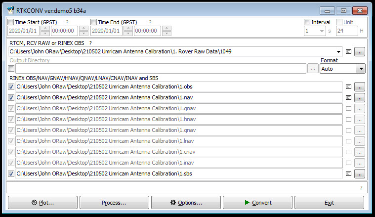

Accurately survey the base location using RINEX files

I use a dedicated Windows 7 computer to manage my _Continuously Operating Reference Station_ (CORS).
I have installed RTKLIB from http://rtkexplorer.com/downloads/rtklib-code/ or you can use the Linux version at the command line.

1. Fix the base antenna in a permanent location. My CORS station uses a steel pole with a survey grade antenna.
2. Set the base with a factory default configuration, to save raw GNSS data. This will work with UBlox-F9P, but may not work with earlier versions. Enable: 
- Raw data by right-clicking **UBX-RXM-RAWX** in U-Centre and enabling.
- Subframe information by right-clicking **UBX-RXM-SFRBX** in U-Centre and enabling.

In U-Centre, go to **Player->Record**. I record 4 hours of data, so I have a good sample size. I use the time as filename and the .ubx extension.

In Base/Rover terms, this is the Rover data.
Next I need to find an official source of RINEX data. In the UK and ireland, this data can be got from OS/OSI.
For my location, I can get data from two stations, Malin and Foyle, at https://gnss.osi.ie/download-rinex.php
I select the station, date, start and end time.
The data downloads as a ZIP file and when I extract the files, I have three files per hour.
Save these in a folder, mine is called **Malin RINEX**.
Note that the data is not available until c. 2 hours after it is logged, and sometimes stations are broken, no data!

1. Run the **RTKLaunch** tool.
2. Run the **RTKCONV** tool.
- As an input file, select your 24-hour log file. Mine was called **1049.ubx**.
- The tool will suggest file names for **OBS**, **NAV** and **SBS** files. 
- Click Convert and go for coffee.
- Save these file in a directory called **Rover RINEX**.

Now I can post-process my data.
3. Run the **RTKPOST** tool.
- The RINEX OBS data is the .o file from the **Rover RINEX** directory.
- The RINEX NAV data is the .n file from the **Rover RINEX** directory.
- Because there are many files, I can use the **?** symbol as a wildcard.
- Click Convert and go for dinner!

I copy the output to a directory called **Solution**. 
There are three files, I load the one without an extension into Excel.
There is a header, and then I get columns of data.
Any row with a **Q** value of **1** is in RTK Fixed mode and should be accurate. I ignore rows with any other Q value.

I can now do calculations, see how stable the position is, get the mean values, variance etc.

  
