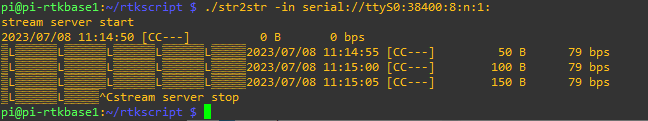

# RPi Base Build

Read the [parts list](Parts.md) before you start! 

1. Configure the PI and do updates, see [1]. Ensure you have enabled the serial port, but disabled the console.
2. Enable and test SSH and VNC.
3. I am using a Waveshare 10.1 screen. Add the following lines to /boot/config.txt

```
hdmi_group=2
hdmi_mode=87
hdmi_cvt 1024 600 60 6 0 0 0
```
4. Install RTKLIB [2].
```
sudo apt update
sudo apt install git
mkdir rtklib
cd rtklib
git clone https://github.com/rtklibexplorer/RTKLIB.git
```
5. Compile RTKLIB
```
cd RTKLIB/app/consapp/str2str/gcc
make
sudo cp str2str /usr/local/bin/str2str
cd ../../rtkrcv/gcc
make
sudo cp rtkrcv /usr/local/bin/rtkrcv
cd ../../../../..
```
6. Configure the GNSS device.
7. Identify which port you are connecting your GNSS device to.
8. My GNSS is on ttyS0, so my test line is:
```
./str2str -in serial://ttyS0:38400:8:n:1:
```
The output is RTCM3 binary, similar to that shown below.


9. You can log the serial stream using
```
./str2str -in serial://ttyS0:38400:8:n:1: -out base_%d%m%y_%h%M.ubx
```


References.

[1] https://www.ardusimple.com/connect-your-simplertk2b-to-a-raspberry-pi/

[2] https://rtklibexplorer.wordpress.com/2022/11/10/raspberry-pi-based-ppk-and-rtk-solutions-with-rtklib/
