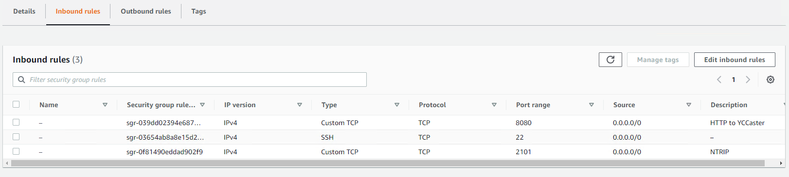
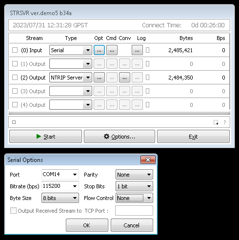
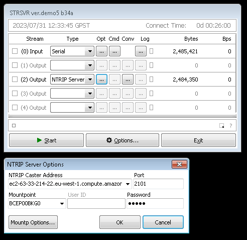
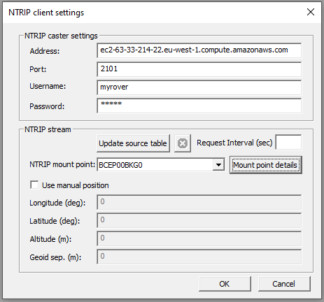
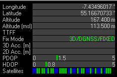

# YCCaster

The objective here is to create a NTRIP caster which is 
- Minimum resource
- Operable in the Cloud
- Can scale up to commercial use

If Linux terrifies you, look at the accompanying notes on using SNIP.

I followed [here](https://yccaster.com/guide) initially, the notes are all correct but bares bones. Follow them exactly to get a demo working.

## Amazon

1. My basic notes on creating AWS instances can be found [here](https://johnoraw.gitbook.io/amazon-web-services/). These notes are only catching up at time of writing, will be complete SEP23
2. In the EC2 console, create a key pair and a minimum Ubuntu server instance. In the security group for this instance, add rules allowing access to TCP port 2101 and 8080.

3. Connect to the instance using the web interface and follow the YCCaster quick start, creating all files and services.
4. On a Windows instance called **RTK-Base**, I [installed](https://github.com/rtklibexplorer/RTKLIB/releases) RTKLIB to test. In this configuration, I am using the USB port (COM14) to connect to the GNSS. Make sure RTCM sentences are enabled on USB!
5. I connected the RPi described in this repo as COM14 using defaults.

6. As an output, I forwarded to my AWS instance called **RTK-Caster**. The mountpoint is the one in the YCCaster example, as is the password.

 

7. To test, I opened U-Center on another computer, **RTK-Rover**. Go to Tools->NTRIP client settings, and enter the username and password as per the clients.yml file created in point 3 above. 
8. The NTRIP mountpoint should populate, click on mount point details to confirm the information from mountpoints.yml created in point 3 above.

 

9. Finally, examine U-Center in **RTK-Rover**. This should quickly go to *Fix Mode: FLOAT* and with a clear sky view, *Fix Mode: FIXED*

 